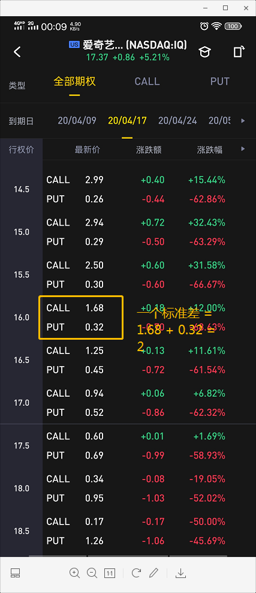

# 隐含波动率 IV (implied volatility)

- 隐含波动率是期权世界最重要的概念之一，是否能熟练掌握隐含波动率这个概念，是区分入门者与进阶者的分水岭

# 为什么我们要学习隐含波动率？

1. 它告诉我们未来的市场风险
2. 隐含波动率能够帮你计算一笔交易的成功率

# 隐含波动率的作用

它的作用是告诉我们，从目前的期权价格推算，一只股票可能会在某个时间到达的价格

比如：微软的股票目前在$165

我看涨这支股票，价格目标是$170

那么，我如何得知这只股票可能在什么时候到达%170呢？

利用隐含波动率

# 历史波动率

一年时间内，这只股票所发生波动的年化标准差

它统计的是在过去一年里，该股票每天发生波动的幅度，得出波动幅度的标准差

也就是说，历史波动率就跟它的名字一样，回顾的是之前的价格波动幅度

历史波动率越大，自然该股票在过去的波动程度也就越大。

# 隐含波动率平价期权

- 正好相反，它着眼于未来
- 隐含波动率IV从期权的价格中衍生得来的，它代表的是目前市场参与者对未来股票波动幅度大小所作出的最好预测 （集体对未来作出的最合理的猜测）

- 在B-S期权定价公式里，IV是六个变量（行权日，行权价，股票现价，无风险利率，期权价格，隐含波动率）里面的其中一个，也是唯一一个不能直接观察到的变量，要得出IV，我们只能填入其他五个变量解出IV

- 或许你产生了疑问，难道我们不需要隐含波动率就能得出期权价格？

- 没错，我们只需要使用ATM（平价）期权来填补为了解出银行波动率所需的五个变量的最后一个
- 为什么？
`因为ATM期权通常是期权链里面交投最活跃的期权，它代表着市场参与者对此期权最合理的出价。`

# 隐含波动率对期权的作用

- 当我们让市场的手去为ATM期权定价之后，我们就可以通过期权定价公式，解出IV

- 到这里，我们就理解了IV为什么时高时低 - 这是因为市场里无形的手在调控这些ATM期权的价格

- 想想财帛哦前夕，会有许多人投机财报，就会产生巨大波动，那么期权价格就会水涨船高，因此，隐含波动率上升

- 想想市场突然暴跌，市场暴跌之际，无论投机者，还是套保者，都会大量买入看跌期权，造成看跌期权的价格暴涨，因此，隐含波动率上升

- 所以隐含波动率的高低，就直接代表了期权价格的高低，IV高，期权贵，IV低，期权便宜。

- 我们假设MSFT的股票价格为$168，而根据它的ATM期权，我们推算出现在的IV=20%

- 这代表着，MSFT这只股票，在期权链上，一个标准差的波动是168 * 20% = $32

- 也就是说，MSFT的上下各一个标准差的波动，将会把股票带到136和200者两个地方

- 正态分布图告诉我们，股价发生上下一个标准差内的波动概率是68%

一个标准差 = ATM straddle 平价  put/call的价格和

例子：

- 这个4月17日到期的期权链，爱奇艺一个标准差的波动是：

行权价$17的call + put = $1.46

假设，你购买了一个16.5的put，我们前面讲过，put的盈亏平衡点 = 15.6 - 0.45
= 15.15

而目前的股价位于$17.37, 你的盈亏平衡点是15.51，所以你需要17.37 - 15.51 = 1.86的价格波动，你才不会亏钱

而我们知道，一个标准差的波动是$1.46,显然不在范围内。

股价发生在上下一个标准差范围内波动的概率是68%，所以，通过购买16.5 PUT来盈利的概率小于32% 甚至 16%

