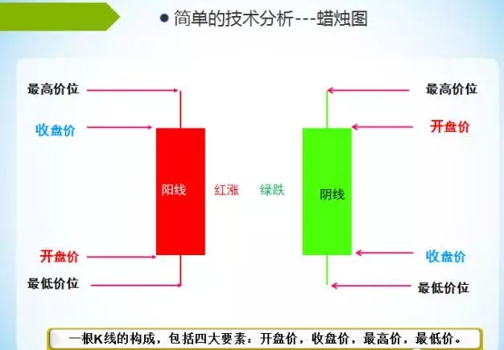
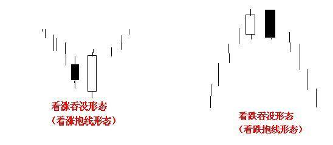

- [主页](../README.md)

# 说在前面

`K线只是规则的载体，离开规则谈K线毫无意义`

# K线的历史及其画法
## 历史

1750年左右，日本，本间宗久，使用K线记录大米价格的高度。著作为《酒田战法》 -> K线心得
60，70年代，由美国人史蒂夫 尼森，引入华尔街，引起注意。

## K线周期

K线包含 `月，周，日，小时，30分钟，15分钟，5分钟` 的周期

K线由四个信息，最高价位，收盘价，开盘价，最低价位，如下图：

## K线的画法

## 核心K线

大阳，大阴，锤子K，倒锤子K，很波动的十字线

波动率加速，加大 = 大资金进入所为 = 大概率 = 可预测性

大K = 大资金

锤子K = V形反转 = 资金推动，资金做盘，资金流入。

小K无意义。

# K线组合实质

从《本间宗久密录》中看，有5中K线组合

1. 三川
2. 三山
3. 三空
4. 三兵
5. 三法

最经典的K线组合

1. 吞没

2. 孕线

孕线形态

`还有十字孕线，也是这个意思`

3. 反转
[http://www.gpdkt.com/jishufenxi/Kxiantu/fanzhuan/19280.html](http://www.gpdkt.com/jishufenxi/Kxiantu/fanzhuan/19280.html), 可以点击此链接学习什么是V形反转
4. 乌云盖顶
[https://wiki.mbalib.com/wiki/%E4%B9%8C%E4%BA%91%E7%9B%96%E9%A1%B6](https://wiki.mbalib.com/wiki/%E4%B9%8C%E4%BA%91%E7%9B%96%E9%A1%B6), 可以点击此链接学习乌云盖顶形态

## 说在后面

    因为K线对于中国来说是再熟悉不过了的，我这里就不在过多赘述，大家自行上网查阅。要记住一些核心K线的变化，但不要过多去迷信它，因为任何技术的都是预测，而预测只是概率的问题。

- [上一页](./什么是三重滤网系统.md) [下一页](./股票的PE是什么如何算市盈率.md)