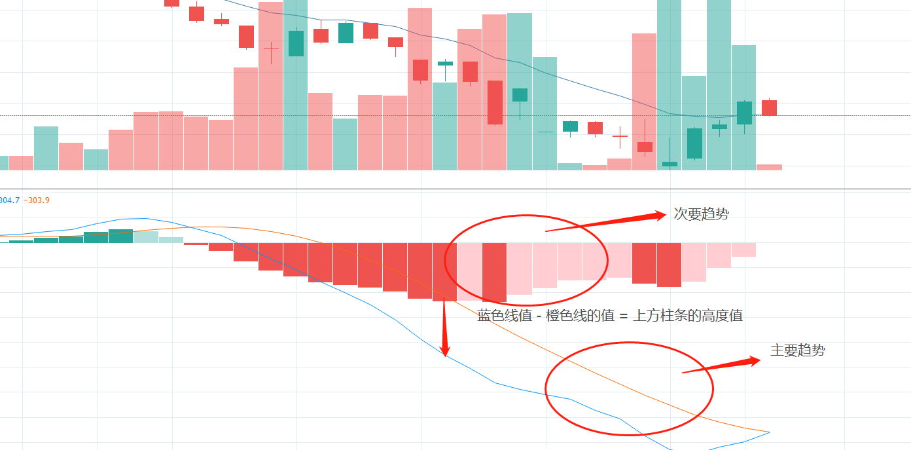

- [主页](../README.md)

##　常用的技术指标--MACD

 - 中文名，指数平滑异同移动平均线

 - 缩写 Moving, Average, Convergence, Divergence

首先，它计算出股价的一条均线，然后加上这条均线的均线，然后计算出他们
之间的差值，非常简单。

怎么读？ 麦克地, 记住别乱读。

他们两个不在一个象限内，你很难判断一个股票的涨跌势。

顶部是一个过程，底部是一个事件。
通常标注，12，26， close 9

可以设置为3，10，16

## 解释

蓝色是第一条根据股价的EMA，而橙色线则是蓝色线的EMA。它们之间的差值用中间的红色柱子来表示
蓝色值减去橙色值如果负数，则柱子在0线下方，若是正数，则柱子在0线上方。

MACD是一种中长线的指标，周线级别的MACD交叉信号非常可靠。

为什么是中长线呢？

它通常会落后6-10bar（柱条）。日线可能给的信号会很慢。不可靠

可以设置为3，10，16来调整。

不过不要盲从技术指标，要控制风险。