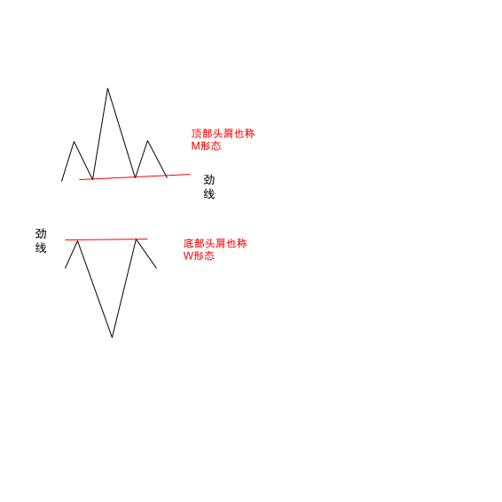
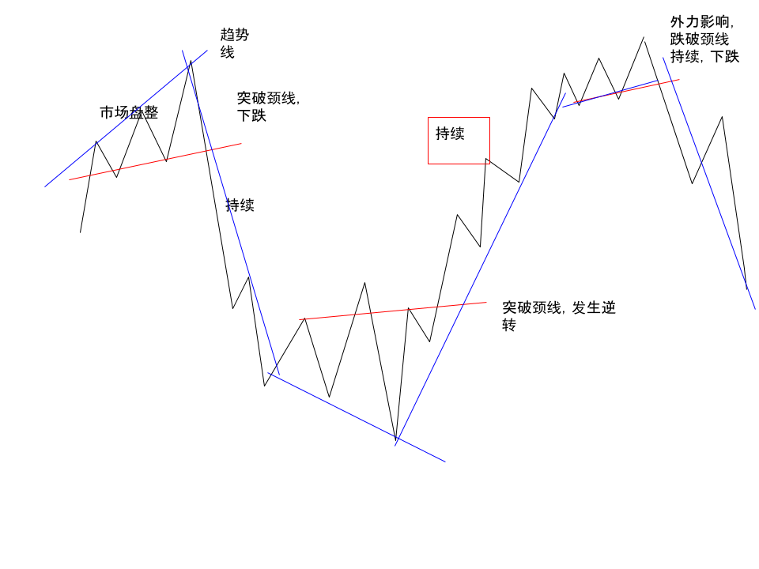

- [主页](../README.md)

# 什么是理查德.沙贝克的逆转与持续理论？

## 基本知识 - 头肩形态

- 顶部头肩

`M 形态是最重要的形态。在技术分析过程中起到很大的作用大家可以重点了解一下。`

- 底部头肩

`也称为W形态。常见在跌幅情况下。`

### 如图所示：

## 颈线

`概念： 将W形态或者M形态。两个拐点之间的连线，称为颈线`

`在劲线突破后是十分有意义的。向上突破，看涨，向下突破看跌`

## 理查德.沙贝克的逆转与持续理论

`概念： 市场就是由逆转或持续两种方式构成的，这是构成市场的基本要素`

`市场在形成M形态或W形态，不会立刻发生逆转，除非其突破或跌破颈线，并形成一种持续的趋势上涨或者下跌。直到有外力出现，（重大事件影响）。则会造成另一轮逆转之后再持续。`

`市场就是周而复始的逆转与持续`
### 逆转与持续如何判断呢？
1. 头肩形态
2.  颈线
3.  趋势线

### 市场基本形态如下图：

- [上一页](./什么是趋势中的形态.md) [下一页](./什么是亚当理论亚当心法.md)
