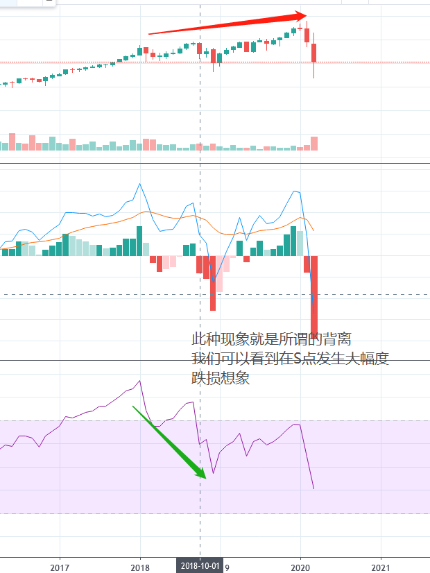

- [主页](../README.md)

# 常用的技术指标

- RSI通过比较价的加减，并通过加权平均计算，来得出价格波动的强弱。
- RSI的计算相当繁杂，因为要分别计算上涨日子和下跌日子的EMA，然后再加权平均得出数据
- RSI的意义在于70以上和30以下的区间。当处于70以上，我们会认为标的物已经超买。而处在30以下
的话超卖，则是极端的读数。应该多加小心。

RSI和股市价格背离，可能会有大事发生

底背离，顶背离

