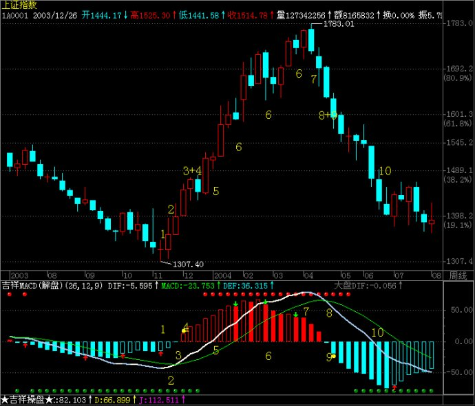

- [主页](../README.md)

# 说在前面

应一位网友的需求，他希望我讲讲MACD，我觉得如果是单纯的讲概念并不能起到多大的作用。所以我把这个概念，带入到亚历山大的三重滤网系统里，系统性地去讲均线在三重滤网系统的具体含义以及运用。因为此次教程有个人的见解和观点在里面，如果有讲的错误的地方还请大家指证出来，以便我之后的更正。因为知识就是在不断地更正中进行的。如果一个人，固执己见，那会是自己的灾难。也会是一个家庭的灾难。如果一个领导人固执己见，那将是一个国家，民族的灾难。扯得有点远，希望大家在此次课程里能各取所需。

# 三重滤网系统

《三重滤网系统》，作者，亚历山大·埃尔德。另外他是一个精神科医生😄。而且书中有他的一些交易心理学知识在里面。

## 为什么要提出三重滤网系统

### 问题：

1. 市场没有圣杯，一个指标不足以解决问题的。
2. 不同指标之间相互矛盾，（趋势指标和震荡指标）
怎么理解呢？书中的原话贴出来，`对于相同的市场，不同的指标将发出相互矛盾的讯号。上升趋势中，顺势指标 将发出买进讯号，但摆荡指标将因为超买而发出卖出讯号。同理，下降趋势中，顺势指标将发出放空讯号，但摆荡指标将因为超卖而发出买进讯号。当趋势明朗时，顺势指标非常适用，但在横向走势中，它们将提供反复的讯号。`
3. 不同时间周期也相互矛盾

### 解决方案：

`用三种方法（三重滤网）来过滤市场信息和指标。`

### 如何来操作呢？

`前提`:

界定你的时间周期，长线(要关注：月线，周线，日线)
中线(要关注：日线，60分钟，15分钟), 日内(要关注：60分钟，15分钟，1分钟)

---------

## 三重滤网是什么呢？

### 一层滤网：用周线MACD来判断 -> 判断方式：MACD斜率

- 什么是MACD指标呢？
有一个0轴，上下有绿色和红色的柱子的就是MACD指标
拿一个上证指数的例子来举例，如下图：

MACD指标的实战技巧，可以在链接中找到，[🔗](https://wiki.mbalib.com/wiki/%E5%B9%B3%E6%BB%91%E5%BC%82%E5%90%8C%E7%A7%BB%E5%8A%A8%E5%B9%B3%E5%9D%87%E7%BA%BF)

我本人不是一个指标交易者，对于指标的研究不是很深，希望网友对这教程持客观态度。但是我建议可以学好三重滤网系统。

---

### 二层滤网：日内的震荡指标
- 劲道指标 （可以忽略，这是作者自己命名的）
- 艾达透指标 （可以忽略，这是作者自己命名的）
- 随机指标 也称为KDJ，我们经常使用的就是RSI，威廉，KDJ

-------

### 三层滤网：日内分时，盘中突破

--------

### 来分析一下它的实际应用场景：

### 说说做多的情况：

#### 开仓核心
1. 周线的MACD斜率向上。
2. 日线KDJ向下（数值要低）
3. 日内盘中向上

同时满足这三个条件就可以开仓。

有人总结 `顺大，逆小，破位`。 什么意思呢？最简单来说，周线向上，日线向下，日内盘中向上突破。

#### 平仓核心

长线用趋势反转，短线日内趋势反转。这不是一个精确的方式，只是作为一个参考方式。

#### 止损核心

日内高低点止损

### 说说做空的情况

做空当然就是相反于做多。😄

1. 周线MACD斜率向下
2. 日线震荡指标向上（KDJ，RSI....）
3. 日内盘中向下突破

核心总结还是`顺大，逆小，破位`。在做空情况下就是在周线向下，日线向上，日内盘中向下突破。

那总结一下， 三重滤网的时间周期。假如我是以周线的MACD来判断的，如果是做日内交易的话，以60分钟的MACD来判断，那就是60分钟MACD向上，15分钟KDJ向下，1分钟盘中向上。不知道大家听懂了没有😂，如果没有可以给我发邮件`gygesm@gmail.com`或者加我的微信`GygesM`共同交流一下。

`我分析一下，上面上证指数的图，它的周线斜率是向上的，所以大的方向就是可以做多。要看它的日内15分钟KDJ如果是向下的，1分钟盘中向上的就可以开仓或做多了。`

三重滤网系统，总的核心就是，那三个条件。

### 补充知识，使用百分比线为基础的三重滤网系统

首先周线趋势是上升的。然后看日线，在日线的最高点和最低点做百分线。1/3处它可能会遇到支撑，在1/2处可能会遇到支撑。
最后看日K线趋势是否向上，然后在此K线点下设置止损

开仓：周线⬆️，日线（1/3，1/2）出⬇️，60分钟K线，突破确认。
止损：60分钟K线突破向上，最低点

`任何一个交易系方法都有自己的弱点，抓住它的弱点方能取胜。任何事情输的一方大部分原因都是心态和纪律。记住：运用此方法交易一定要设止损`

# 说在后面

首先三重滤网系统是作者自己经验的总结。其实，每个人都可以根据自己的经验和判断，并总结和构建自己的三重滤网系统。找到适合自己的交易方式才是最重要的。总之，还是那句话，弱水三千，只取一瓢饮。

- [上一页](./什么是亚当理论亚当心法.md) [下一页](./K线历史和画法以及其关键K线形成背后的原因.md)