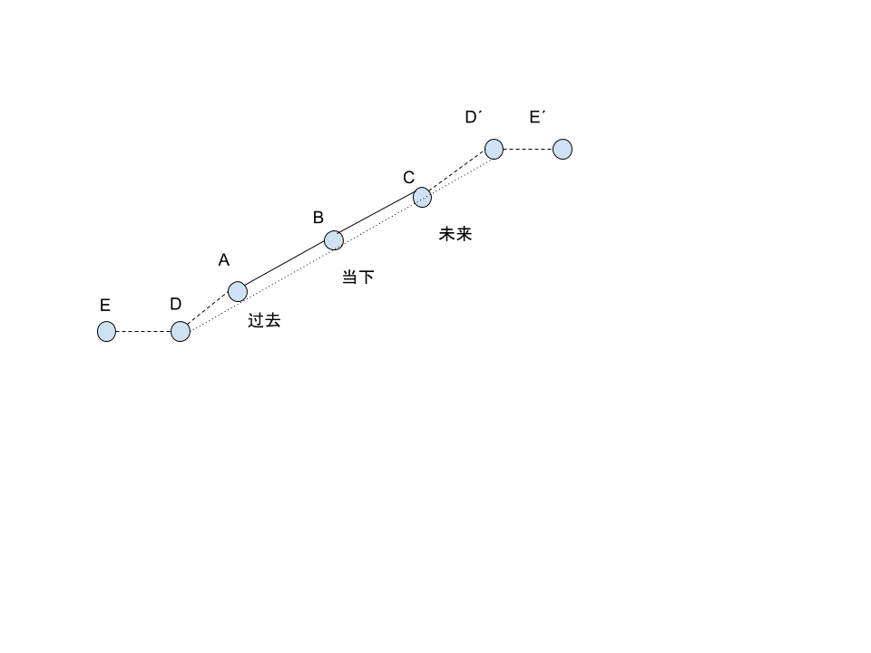

- [主页](../README.md)

## 说到前面
`希望所有的金融交易人员。家庭是第一位，不要盲目地冒险去投资，不要贷款，融资，信用抵押，这样的风险对于一个股票交易人员来说是得不偿失的。拿出你财产的盈余一部分去投资，慢慢锻炼，不要着急，必定会有所收获。`

## 亚当理论

`首先亚当是介于顺人性和反人性之间，怎么说呢？比如一些技术分析，趋势线，均线，箱体理论就是反人性的。你不需要做什么，你只要跟随就是。又比如说，像江恩理论，波浪理论，百分线，缠论，都是顺人性的，你可以去预测，推断涨跌。`

亚当理论作者，威尔斯·维尔德（技术分析之父，指标之父）

### 心法：
1. 从事交易你不需要了解太多，比你看到的还要少。以5岁小孩的心态去看待交易
2. 在市场中成功，我们必须投降。快速改变想法，善于在交易中否定自己。
3. 对有些事情要视而不见，`价格包含一切`，包含供给与需求
4. 避免武断方法①设每日止损点②移动止盈。
5. 优秀的交易者会利用方向和持续期，而非转折点。
6. 如果一个标的一直跌，我会卖到它跌到零为止，如果一直涨，我会买到涨到月球位置。
7. 我们关于市场所有的知识，最终会成为你成功的绊脚石。

### 解释亚当理论
`你必须理解一件事情，就是这个世界的所有物种，都是以消耗能量少而自居。如何消耗能量少呢？就是不断地重复自己的事情，不产生任何重大的变化，就不消耗任何额外的能量。`

`来市场的目的 -> 赚钱 -> 臣服市场 -> 价格包含一切 -> 价格通过趋势反应`

什么是趋势？ `趋势就是惯性`, 精确重复的事情就是惯性， 惯性①物理惯性②行情惯性。

行情会沿着它的惯性走，直到有一个力量打破它的惯性，会按另一种惯性接着走下去。

什么是精确重复的事情？ 对称 -> ①中心对称②完美对称

中心对称：映像与维度, 如下图

完美对称：①接近②速率③接近+速率

如何使用对称预测未来呢？

举个例子：

解释：
A ，B， C 各点分别代表过去，当下，未来。A点之后的点D点和E点，如果你想从D点去预测未来市场的情况，以中心点B点（当下点）做对称，就可以得到未来的行情D' 和 E' 点

什么是完美对称呢？

1. `如果是在当下B点，A点，D点，E点越接近B点，那么对称的C点和D'点，E‘点更有效果`

2. `如果在当下这个B点，运动速率越快，那么对称结果就比较好`

3. `如果接近和速率（以上两点）都满足的很好，那么对称结果就很好。`

`亚当理论的方法就是找对称，使用翻亚当方式，做对称，有一个软件可以实现，snipaste`

`下载链接：`[https://zh.snipaste.com/](https://zh.snipaste.com/)

`老方法：`

1. 在你要绘制的图上放一块透明胶片。
2. 用一只可以在胶片上画图的笔，从时间上最近的那一天开始(比如今天)，在图上画出过去的每一天，具体画出多少天，由你自己决定。
3. 然后把透明胶片翻过来，就像是看书的时候翻页一样。
4. 接着抓住胶片的底端，从下往上翻，这样你的手最后会放在胶片的顶端。
5. 现在把胶片上的第一天(在左手边)与条形图上的最后一天(最近一天)重叠。

### 如何找翻亚当开仓点（买入，卖出）

1. 突破（找到高低点。好条件：时间长，波动大比较好）
`正所谓：横有多长，竖有多高 😂🎁`
2. 趋势改变
3. 缺口（缺口，高开低开）

###  如何止盈呢？

1. 翻亚当之后的高点
2. 翻亚当之后的低点，移动止盈

###  如何止损呢？

1. 前期的低点
2. 开仓的低点

###  如何加仓呢？

1. 金字塔式加仓

这里是对金字塔加仓发的解释：

[🔗](https://wiki.mbalib.com/wiki/%E9%87%91%E5%AD%97%E5%A1%94%E5%BC%8F%E5%8A%A0%E4%BB%93%E6%B3%95)

这里是对倒金字塔的加仓方式进行解释：

[🔗](https://wiki.mbalib.com/wiki/%E5%80%92%E9%87%91%E5%AD%97%E5%A1%94%E5%BC%8F%E5%8A%A0%E4%BB%93%E6%B3%95)

### 如何翻亚当呢？
`翻的时候对接点是突破的那根K线
只翻突破前的转折 不翻全部的震荡区
由于突破表示惯性改变 所以之前的震荡区惯性已不适用`

## 说在后面

`首先希望大家都能学好亚当理论，修行在个人，一定要多实践，多学习才行。建议有兴趣的朋友可以买本《亚当理论》的书拿来研究一下。实盘操作才是最重要的。最后希望大家都能赚钱，不为钱而发愁。`

- [上一页](./什么是M头W底什么是理查德沙贝克的逆转与持续理论.md) [下一页](./什么是指数平滑移动平均线MACD.md)
