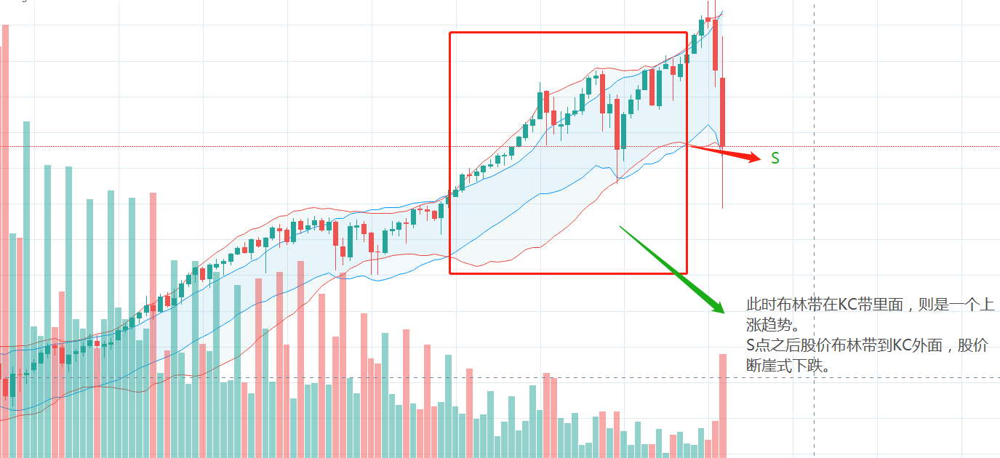

- [主页](../README.md)

- 布林带是最为人所熟知。但是又最常被误用的一个指标

- 布林带的构建：中轨、上轨、下轨。其中，中轨是某个时间段的SMA，
而上轨和下轨则是根据这个时间段的标准差来计算。
- 所以布林带会根据标准差的大小从而收缩和扩大。
- 因此，布林带只能告诉你，目前的价格波动是否剧烈，但是完全不能给你提供其他信息，例如被人津津乐道的下轨支撑，上轨阻力等
- 将布林带与其他指标结合一起使用，会找到潜在交易机会。

布林带和KC指标来确认交易信号

