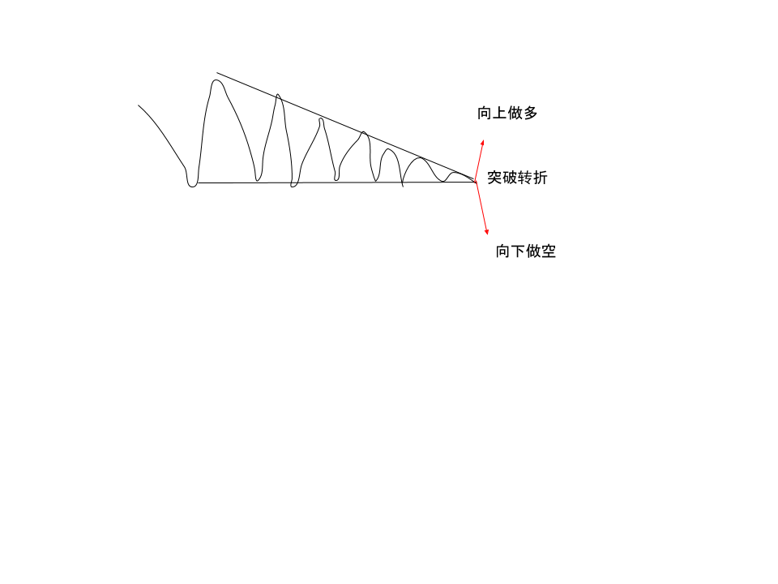
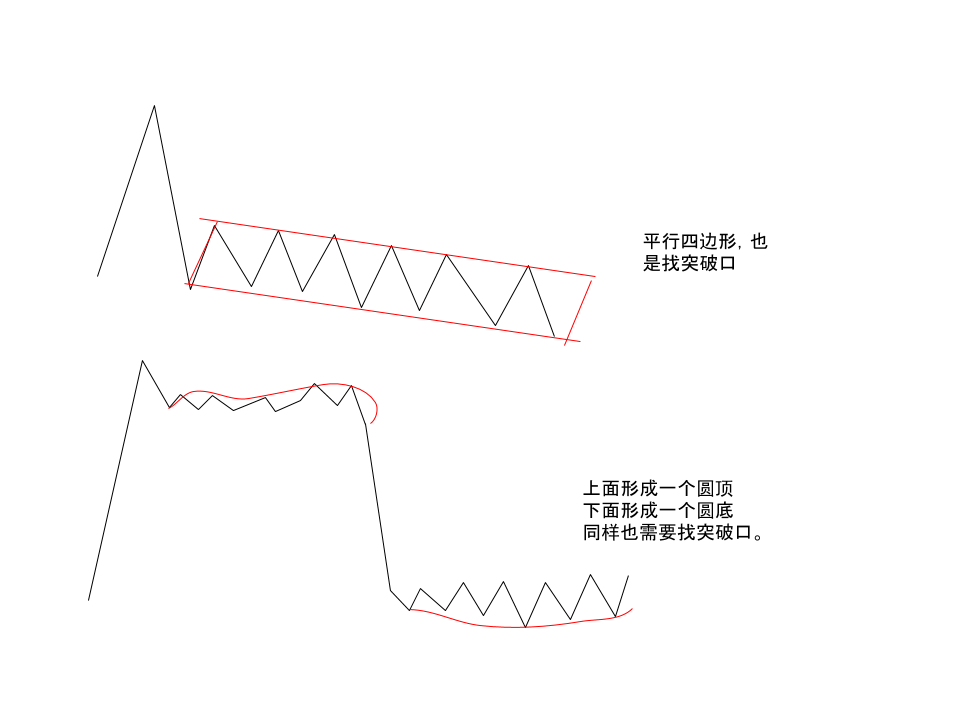
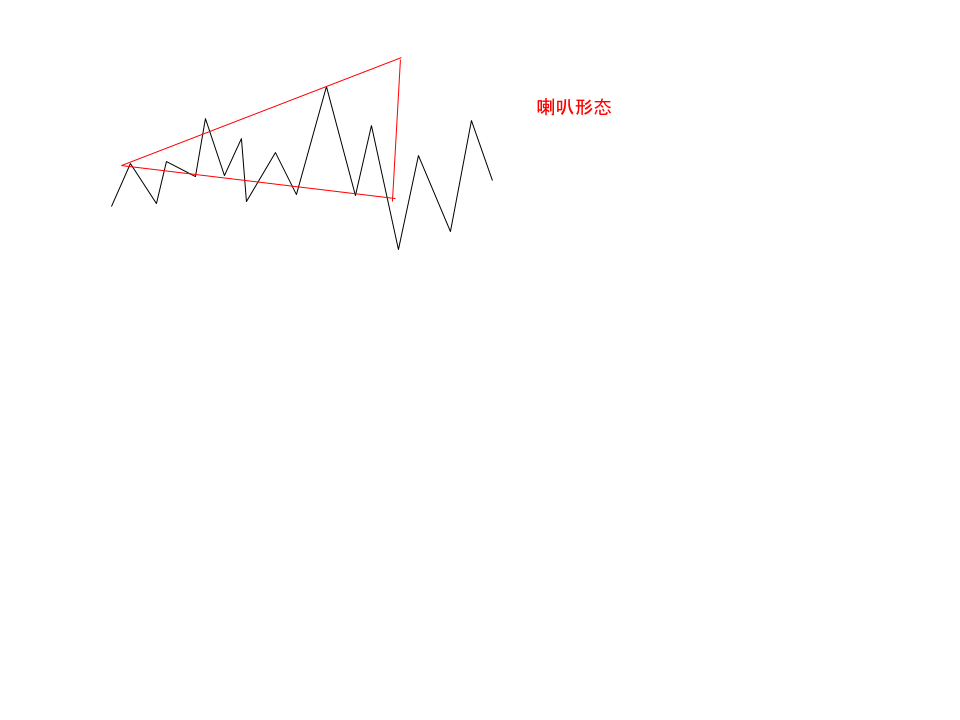

- [主页](../README.md)

 # 形态理论及其意义

 ## 三角形
 `最有用，最普遍的形态`

 ### 如下图

`三角形收敛之后，形成新的趋势`

## 平行四边形 和 圆顶，圆底

`三角形是最重要的`

## 钻石形态
`经常形成在顶和底，说明市场波动剧烈，也需要找突破点`

## 喇叭形态 （反三角形）
`具有参考意义，很多股灾/暴跌都是这样的形态，跌幅很大`

`所有形态，都是只有突破后才有他的意义。如果向上突破就继续持有和做多，如果下跌，就持续卖出，或者平仓，不能利用技术分析，去预测那就打错特错了。技术分析，只是让你在遇到某种情况下的提供一种参考方式`